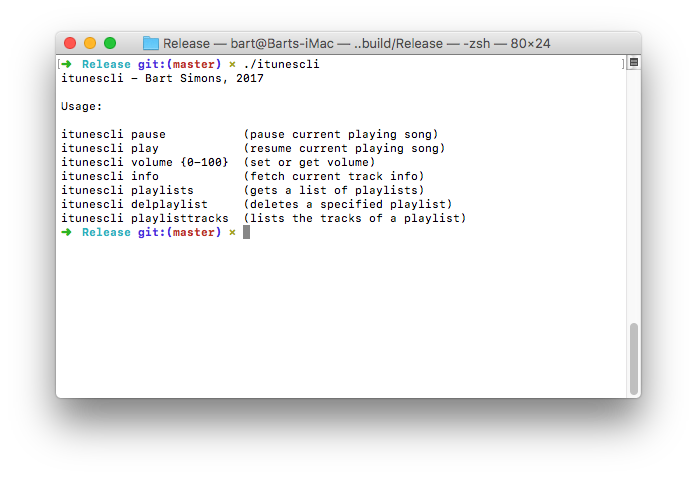

**itunescli**
-------------
A simple command-line utility that talks to iTunes, built using Swift!

**How to compile**
First of all, you need Xcode on your Mac to build this. If you got Xcode on your Mac, cd into the root directory of this repository and just run 'xcodebuild' to generate an executable.
